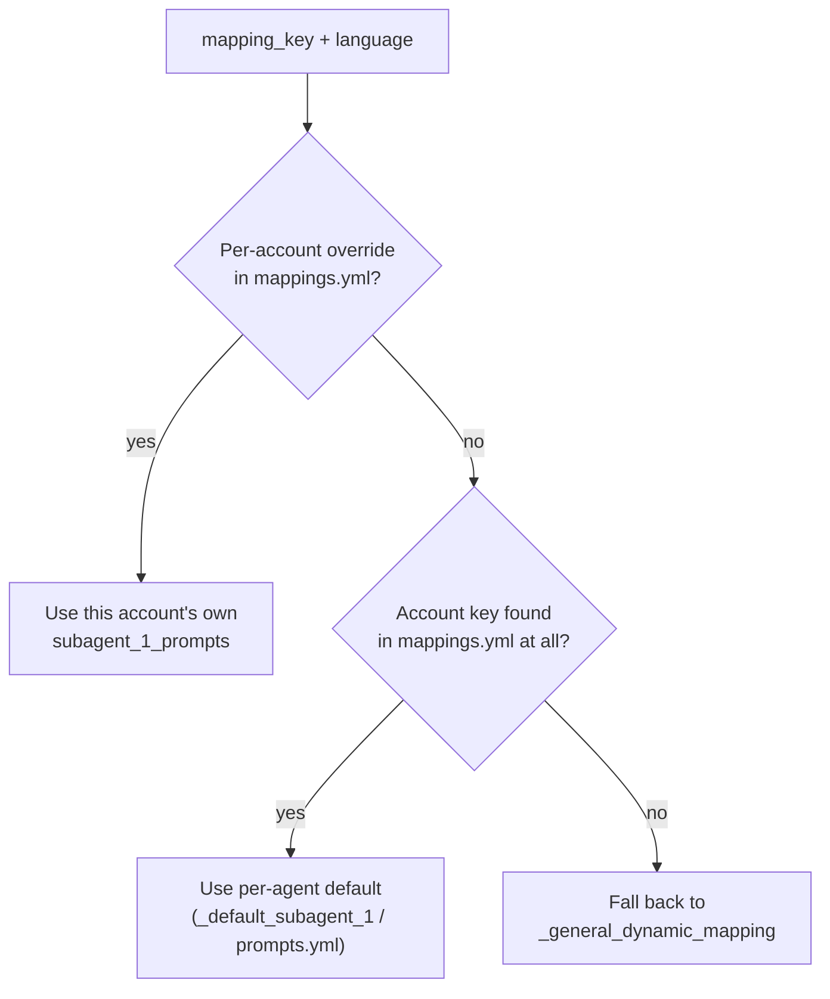
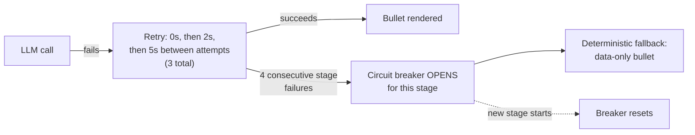
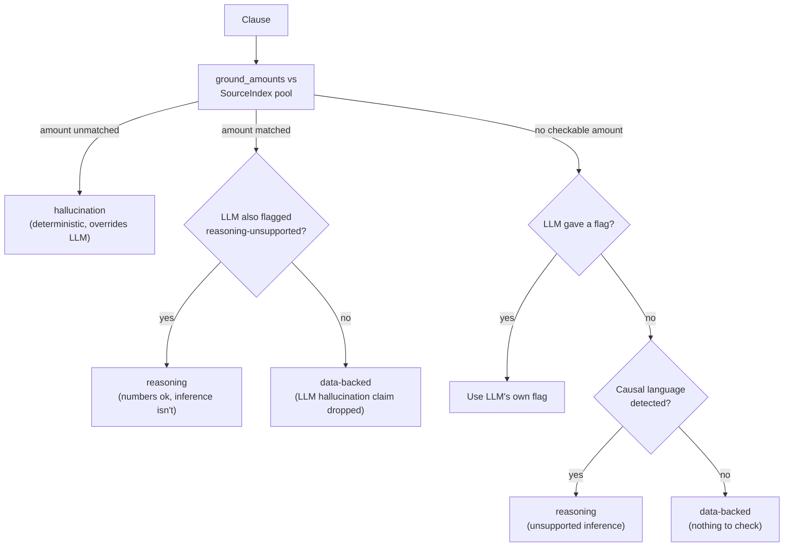
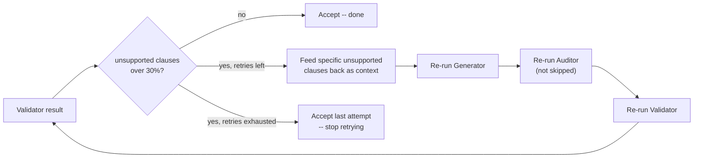
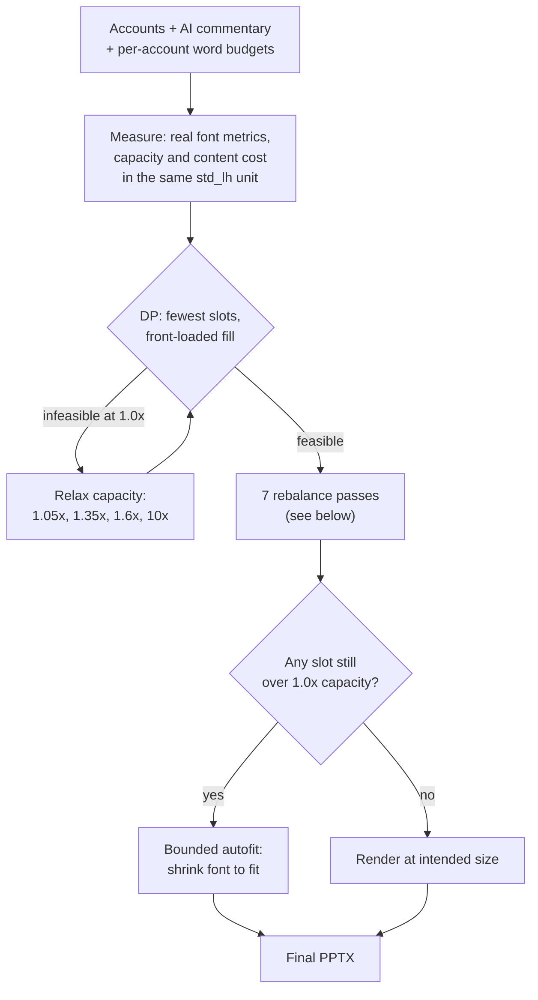
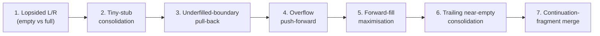

# Financial Due Diligence (FDD) Tool

Automated financial commentary generation from Excel databooks, powered by a multi-stage AI pipeline with reconciliation and PowerPoint export.

---

## Quick Start

```bash
pip install -r requirements.txt
streamlit run fdd_app.py
```

---

## Pipeline Overview

```
Excel Databook
      |
      v
+---------------------+
| 1. Profile & Resolve|  Detect sheet types, match tabs to account mappings
+---------------------+
      |
      v
+---------------------+
| 2. Normalize        |  Extract indicative-adjusted periods, build DataFrames
+---------------------+
      |
      v
+---------------------+
| 3. Reconcile        |  Cross-verify tab totals against Financials sheet (BS/IS)
+---------------------+
      |
      v
+---------------------------+
| 4. AI Subagent Pipeline   |
|                           |
|  Generator ──> Auditor ──> Validator   (Refiner: wired up, dormant)
|  (create)     (verify)    (evidence check)
|      ^                          |
|      |____ feedback loop (if needed) ____|
+---------------------------+
      |
      v
+---------------------+
| 5. PPTX Export      |  Slot-based text distribution across template slides
+---------------------+
      |
      v
  Final Report (.pptx)
```

---

## Architecture

| Module | Responsibility |
|--------|---------------|
| `fdd_utils/workbook.py` | Workbook profiling, sheet resolution, normalization, reconciliation |
| `fdd_utils/ai.py` | AI config, prompt engine, subagent pipeline + harness + audit + feedback loop |
| `fdd_utils/pptx.py` | PPTX payload building, slide generation, executive summaries |
| `fdd_utils/ui.py` | Streamlit UI, processed view, AI panel, sidebar |
| `fdd_utils/mappings.yml` | Account definitions, aliases, Generator prompts |
| `fdd_utils/prompts.yml` | Auditor / Refiner / Validator prompts |
| `fdd_utils/config.yml` | Runtime config (AI providers, agent parameters, PPTX tuning) |

---

## The Subagents

Named `subagent_1`–`subagent_4` in code/config for historical reasons, but only
**3 stages run at runtime** — `subagent_3` (Refiner) is wired up, prompted, and
tested, but deliberately dormant (`SUBAGENT_SEQUENCE` in `ai.py` skips it). It
stays in the codebase because tightening-for-length is a real, recurring need
that's cheap to re-enable (one line) the moment a account type needs it again —
removing it outright would mean re-deriving the prompt from scratch later.

| Stage | Agent | Role | Runs by default? |
|-------|-------|------|---|
| 1 | **Generator** | Creates financial commentary from data + prompts | Yes |
| 2 | **Auditor** | Verifies figures, trend direction, and format accuracy | Yes |
| 3 | **Refiner** | Tightens length while preserving key facts and reasoning | No (dormant) |
| 4 | **Validator** | Final evidence check with clause-level hallucination detection | Yes |

A feedback loop retries Generator + Auditor + Validator when too many clauses
come back unsupported — see [AI Engineering](#ai-engineering-prompts-harness-audit-loop) below.

---

## AI Engineering: Prompts, Harness, Audit, Loop

The AI side of this tool isn't "call an LLM, print the answer" — it's four
separate engineering concerns, each solving a different failure mode, stacked
on top of each other. It's worth naming them individually because they're
easy to conflate but need very different fixes when something goes wrong:

- **Prompt engineering** — get the model to produce the right content, in the
  right style, in one shot as often as possible.
- **Harness** — assume the model call itself will sometimes fail, hang, or
  come back garbled, and keep the pipeline moving anyway.
- **Audit** — assume the model's own claim about its output ("this is
  correct") cannot be trusted, and check it independently.
- **Loop** — when the audit finds a real problem, don't just flag it — feed
  the specific problem back and let the model try again.

### Prompt Engineering

Every account gets a **three-tier prompt resolution** (`PromptEngine.get_prompt_pair`
in `ai.py`), most specific wins:

1. A per-account override in `mappings.yml` (`subagent_1_prompts.<language>`) —
   used when an account type needs bespoke instructions (e.g. the exact stock
   phrase for related-party loans, or which sub-components to cover for PP&E).
2. A per-agent, per-language default (`mappings.yml._default_subagent_1` for
   the Generator; `prompts.yml.<agent>.<language>` for Auditor/Validator).
3. Falls back to `_general_dynamic_mapping` if the account isn't in
   `mappings.yml` at all, so an unrecognised account still gets a sane prompt
   instead of an empty one.



Each account's Generator prompt carries its own **word-count budget**, sized
to the account's real complexity (see [Text-to-Layout Utilisation](#text-to-layout-utilisation-how-the-packer-decides-what-goes-where)
above) — this is the main lever for controlling both commentary depth and,
indirectly, page fill. On top of per-account prompts, a shared **style layer**
(see [Style Enforcement](#style-enforcement) below) — formulaic openings,
banned bloat patterns, and a deterministic regex polish pass — keeps output
consistent across hundreds of AI calls that all have slightly different
account context, rather than relying on the model to stay consistent purely
from instructions.

### The Harness (Reliability)

The pipeline assumes the LLM endpoint may be slow, rate-limited, or briefly
unavailable, independent of whether the prompt or the audit logic is doing
its job correctly. Several layers cushion that:



| Layer | Behaviour | Tunable |
|---|---|---|
| **Per-call timeout** | 30s on the HTTP client and the thread join. Failures throw fast. | `_run_ai_call(timeout=...)` in `ai.py` |
| **Retry with exponential backoff** | 3 attempts per call: `0s → 2s → 5s` between them. Lets the API recover instead of hammering it. | `retry_backoffs` in `process_single_agent_item` |
| **Circuit breaker (per stage)** | After 4 consecutive failures inside a stage, remaining calls in that stage skip the LLM and go straight to the fallback. Resets at the start of every new stage. | `_StageCircuitBreaker(threshold=4)` in `ai.py` |
| **Deterministic fallback** | When all retries are exhausted, the Generator falls back to a one-line data-only bullet built from the dataframe (`the balance as at <date> totalled CNY<X> million.`) marked as auto-summary. Subsequent stages reuse the previous successful output if they fail. | `_build_deterministic_fallback_bullet` in `ai.py` |
| **Concurrency cap** | At most **2 concurrent LLM calls** (across all three threadpools: `run_agent_stage`, feedback-loop, evaluator). Prevents the pipeline from saturating a stressed endpoint. | `max_workers = 2` in `ai.py` and `pptx.py` config |
| **PPTX-export bypass** | If section summaries weren't pre-generated during the AI phase, PPTX export does NOT make a fallback LLM call — it leaves the executive-summary box blank rather than burning 1–3 min per slide. Re-run the AI step to populate. | `pre_generated_summary` branch in `pptx.py` |

End-to-end the worst case is now bounded: each LLM call costs at most `(0+30) + (2+30) + (5+30) = 97s` before the breaker trips, after which the rest of the stage falls through to the data-only fallback in milliseconds. None of this cares whether the model's *content* was good — it only guarantees the pipeline finishes.

### The Audit Layer (Deterministic Grounding)

The Validator stage asks the model to review its own output clause-by-clause
and flag anything unsupported — but a model's self-review is itself a soft
judgement, prone to the same failure mode it's meant to catch (it can be
confidently wrong about its own arithmetic). So every numeric claim gets a
**deterministic, code-based check that overrides the model's opinion**:

1. `segment_clauses` splits the final text into clauses (sentence/comma
   boundaries, protecting decimals and thousands separators) — these are
   exact substrings of the rendered text, so a flag can be highlighted by
   precise character offset, not fuzzy matching.
2. `SourceIndex.from_df` builds a pool of every number that could legitimately
   be cited: every numeric-table cell, column totals, sums of small runs of
   adjacent rows (commentary often groups a handful of breakdown lines into
   one figure), numbers appearing in supporting notes/remarks text, the
   annualised multiple of a partial-year figure, and — bounded to the same
   statement type — numbers from *sibling* accounts' data (a note legitimately
   citing a related account's balance shouldn't be flagged just because it's
   not on this account's own tab).
3. `ground_amounts` checks each clause's money amount against that pool with a
   tolerance that matches real rounding conventions (±5% at million scale, a
   flat ±500 floor plus 5% below that, to cover conventional 万-unit rounding
   in Chinese commentary) — not exact-match, which would false-flag normal
   rounding as fabrication.
4. `_combine_verdict` sets the precedence: **a deterministic unmatched amount
   is authoritative — the model cannot argue with it.** When the numbers DO
   match, an LLM "reasoning unsupported" flag is still preserved (numbers can
   be fine while the causal inference drawn from them isn't) but an LLM
   "hallucination" claim about a matched number is dropped as a false
   positive. Clauses with no checkable number at all defer to the LLM's soft
   judgement, or to a "causal language detected → flag as reasoning" rule if
   the LLM gave nothing.
5. A confidence gate (`highlight_min_conf`, default 0.6) demotes low-confidence
   flags so they don't visually highlight — keeping false-positive noise low
   was an explicit design priority over catching every possible soft issue.



The result (`clause_reviews`) surfaces the same way in both places a human
reviews the output:

| Layer | Where | Colour |
|---|---|---|
| UI panel | Streamlit `build_highlighted_commentary_html` | inline orange (reasoning) / red (hallucination) |
| PPTX bullets | `_add_runs_for_line` in `pptx.py` | per-run RGB: orange `(213,94,0)` / red `(200,16,46)` |

The underlying principle: **never trust a model's self-report of factual
correctness when the fact is independently checkable.** Reserve the model's
own judgement for the genuinely soft parts — whether an inference is
well-supported, not whether a number is right.

### The Loop (Feedback / Self-Correction)

A single Generator → Auditor → Validator pass is open-loop — if the Validator
finds real problems, nothing happens automatically unless something closes
the loop back to generation. `_run_feedback_loop_for_key` does exactly that,
per account, up to `max_retries` (default 2) times:

1. After Validation, `_evaluate_feedback_needed` checks the unsupported-clause
   ratio from step 4-5 above. If it exceeds `unsupported_threshold` (default
   0.3 — i.e. more than 30% of clauses came back unsupported), a retry fires.
2. `format_validator_feedback_for_reprompt` turns the *specific* unsupported
   clauses and reasons into extra context appended to the retry's user
   comment — the model isn't just told "try again," it's told exactly what
   was wrong.
3. Generator re-runs with that feedback, then — importantly — **Auditor
   re-runs too**, not just Validator: skipping the re-audit step was tried and
   caused more clauses to fail validation on the retry, not fewer, since the
   Validator was then reviewing raw regenerated output instead of the
   polished version.
4. Validator re-runs on the polished retry; if still over threshold, repeat up
   to the retry cap, after which the pipeline accepts whatever the last
   attempt produced rather than looping forever.



This closes the audit layer into an actual correction mechanism instead of
just a warning label — the system gets a bounded number of genuine chances to
fix a real problem before a human ever sees it.

---

## Text-to-Layout Utilisation: How the Packer Decides What Goes Where

Turning a variable amount of AI-written text into a fixed grid of PowerPoint
text boxes — with no visible empty box next to a full one, no box that
overflows its border, and no sentence cut off mid-number — sounds like a
one-line "does it fit" check. In practice it's a real constrained-optimisation
problem with several conflicting objectives at once (use as few slides as
possible, keep every slide's fill high, never overflow, never leave a box
looking obviously blank, never cut a split account at an ugly point), and this
codebase has iterated on it across many real-report test cycles because a fix
for one objective routinely breaks another.



The mechanics, in order:

**1. Measurement, not estimation.** `_calculate_max_lines_for_textbox` and
`_calculate_content_lines` both measure against the *same* real font-metrics
engine (`text_metrics.py`, backed by Pillow glyph metrics, or the client's own
exported `metrics.json` when configured) rather than a rough
words-per-line heuristic. Both are expressed in the same unit — one
`std_lh` = `line_height + paragraph_gap` — so capacity and content-cost are
directly comparable floats (deliberately *not* rounded/floored: an early
version floored the capacity side only, which silently discarded up to a
full line of genuinely usable box height on every slot). Content cost accounts
for the category-header line, the hanging-indent exception on an account's own
first wrapped line vs. its continuation lines, and Chinese vs. English glyph
width separately.

**2. A "text justification" DP, not a load-balancer.** `_optimize_slot_fill`
flattens every account into reading order and finds the best way to cut that
sequence into contiguous slot-sized chunks — the same shape as the classic
optimal-paragraph-layout problem. Its objective is lexicographic:
**(fewest non-empty slots, then lowest front-loaded underfill penalty)**. Every
slot except the *last one used* is penalised for falling short of
`target_fill_min_ratio` (0.95); the last slot is exempt, because a lighter
final page is normal and expected. This deliberately front-loads content
instead of spreading it evenly — an earlier "just minimise the worst slot"
objective would happily leave every slide at a uniform 70% instead of packing
the first N-1 slides near-full and letting only the true final one run light.
The DP first tries the *minimum* number of slots the content could physically
fit in (`S_min`), and only expands if that's infeasible, so it defaults to
using as few slides as the content actually needs.

**3. Progressive relax, never a hard failure.** If even the maximum available
slots can't fit everything at strict 1.0× capacity, the DP retries at wider
capacity multipliers (`1.0 → 1.05/shape_height_utilization → 1.35 → 1.6 →
10.0×`) until a partition exists. The 10× tier is a last-resort guarantee —
content is never silently dropped — but real overflow past 1.0× is only ever
safe because of the autofit safety net described below.

**4. Splitting an account across boxes, safely.** When an account's
commentary is too long for one box, the split point is chosen at a paragraph
boundary first, then a sentence boundary, then (via `jieba` for Chinese) a
word boundary — and `_snap_split_before_number` pulls the cut point earlier
rather than through a number, date, or currency figure. This runs both in the
initial forward-fill and, if a rebalance pass needs to move partial content
later, again — an account can legitimately end up split across 3+ boxes if
that's what filling every boundary takes.

**5. Post-DP rebalancing.** The DP's own objective is necessarily a
simplification — it can't see every real-world layout expectation at once —
so a sequence of narrowly-scoped passes runs afterward, each fixing one
specific pattern the DP objective alone doesn't cover, in this fixed order:



| Pass | Fixes |
|---|---|
| Lopsided L/R pairs | A same-slide two-column pair where one column is completely empty and the other is full (the DP's objective gives an empty slot zero penalty, so this can look "free" to it even when it reads as visibly broken) |
| Tiny-stub consolidation | A near-empty trailing column (e.g. one orphaned short bullet) folded into its fuller sibling when it fits whole |
| Underfilled-boundary pull-back | Generalises the above to columns that are both non-empty but unevenly filled — pulls a following slot's next account back if it measurably improves the pair |
| Overflow push-forward | The opposite direction: shrinks an overflowing slot's trailing content (whole account, or a safe partial split) forward into a following slot with room |
| Forward-fill maximisation | Greedily pulls a later slot's content backward into any earlier slot with spare room, front-loading as much as the DP's own initial partition didn't already achieve |
| Trailing near-empty consolidation | Drops a genuinely negligible final slide's content back a page rather than opening a new slide for a sliver of text |
| Continuation-fragment merge | If an account still ends up split into 2+ pieces sitting in the *same* box (a later pass can re-split an already-split fragment), merges the run back into one bullet so the reader never sees a spurious "(续)" continuation label next to its own head |

Each of these exists because a *specific real production deck* hit the
pattern — this is genuinely trial-tested against real AI-generated content,
not designed on paper. It's also the part of the system most prone to
regressions: passes interact (one pass's fix can be undone by another running
later, or can surface a new pattern that was previously impossible), so any
change here needs verification against real, previously-working decks, not
just synthetic test cases — synthetic reconstructions have repeatedly passed
locally while still failing on real content in this project's history.

**6. Autofit as the safety net, not the plan.** When accepted overflow (the
relax tiers above 1.0×) actually lands in the final output,
`_apply_bounded_autofit` writes a bounded `<a:normAutofit fontScale=".."/>` so
PowerPoint shrinks the text to fit instead of clipping it — floored at a
minimum legible scale so an extreme worst-case still clips rather than
rendering unreadably small text. Slots packed within strict 1.0× keep the
exact intended font size untouched.

**7. The upstream lever: word budgets.** All of the above only rearranges
text that already exists — the real control on how much a given account
*wants* to fill is its word-count target in `mappings.yml`'s per-account
Generator prompt (these are tuned per account by materiality/complexity, not
a uniform BS/IS split — a simple cash-balance account might target 25–50
words while a property/PP&E account with mortgage, CAPEX, and final-accounting
context might target 100–200). If a page looks under-filled after a run, the
first thing to check is whether that page's accounts have realistic word
budgets for the space available — the packer can rearrange but can't conjure
content the prompts didn't ask for.

Tuning knobs live in `pptx.py` under `commentary_packing`:

| Setting | Default | Effect |
|---|---|---|
| `shape_height_utilization` | 1.05 | First relax tier above strict 1.0× capacity |
| `target_fill_min_ratio` | 0.95 | Lower bound the DP's penalty function tries to hit per (non-final) slot |
| `target_fill_max_ratio` | 1.00 | Upper bound the DP tries to hit per slot |
| `move_whole_min_fill_ratio` | 0.50 | Pull a whole bullet forward when the current slot is at least this full |
| `minimum_slot_lines` | 20–22 | Floor for the capacity heuristic when shape height can't be measured |
| `max_commentary_slides_per_statement` | 4 | How many slides to claim per statement (BS / IS) |

---

## Style Enforcement

Two layers ensure commentary matches the project's reference style:

1. **Prompt-level** (`mappings.yml`, `prompts.yml`) — formulaic openings, banned bloat patterns, length caps per account type, anti-hallucination rules.
2. **Post-process polish** (`polish_english_commentary` in `ai.py`) — deterministic regex pass that catches AI leaks the prompt missed:
   - ISO dates → `dd Month yyyy`
   - `The balance as at` → `the balance as at`
   - `CNY 7.90 million` → `CNY7.9 million` (no space, 1dp)
   - `CNY 78.2K` → `CNY78,200` (no K notation)
   - `CNY0` / `CNY0.0 million` → `nil`
   - Strips period-on-period filler, verbose cross-checks, advisory `You should…`, annualisation projections, calculated rates not in source, land residual hallucinations, and meta-commentary.

---

## Looking Ahead: This App as Agents Get More Capable

Several subsystems in this codebase exist specifically because *today's*
models and tooling have limits — not because the underlying problem
inherently needs hand-written code forever. Worth naming explicitly, so
future work re-evaluates these instead of just accumulating more patches on
top of them (the packing pipeline above is the cautionary example: it's grown
from one DP into a DP plus several sequential patch passes, each solving one
real bug, precisely because no single pass ever generalised — see that
section's note on regressions).

**Likely to shrink or disappear as agents improve:**

- **The packing pipeline** is hand-engineered bin-packing because no model in
  this pipeline today has reliable tool access to *measure* rendered text
  against a real text box and iterate. A future agent that can render a draft,
  check actual overflow/fill against the real shape geometry, and re-lay-out
  based on that feedback could replace the DP-plus-rebalance-passes structure
  with a render-check-adjust loop — closer to how a human actually does
  layout, rather than a fixed objective function decided in advance.
- **The fixed 3-stage subagent sequence** (always Generator → Auditor →
  Validator, applied uniformly to every account) is a workaround for models
  that can't yet reliably decide *for themselves* how much scrutiny a given
  piece of content needs. A simple, low-materiality account (say, a nil
  balance with no history) plausibly needs one pass; a complex adjusted
  earnings walk needs several. A more capable orchestrating agent could make
  that call per account instead of running every account through the same
  fixed pipeline regardless of complexity.
- **Some of the audit layer's brittleness** (regex-based clause segmentation,
  a hand-built numeric-matching tolerance table) is a workaround for not
  being able to trust a model's own arithmetic. As tool-use / code-execution
  becomes a standard, reliable part of how a model checks its own numeric
  claims, some of this could move from "external Python code checking the
  model" to "the model checking itself with a calculator it actually trusts
  to be right" — though see below on why the *external* check likely
  shouldn't disappear entirely.

**Likely to stay, regardless of model capability:**

- **A deterministic, code-based audit as the final word on numeric claims.**
  This isn't purely a capability gap — it's a defense-in-depth principle for
  a professional deliverable: an independent, non-model check on factual
  claims is good practice even if the model doing the generating is
  extremely reliable, the same way a second reviewer doesn't stop reviewing
  just because the first drafter got better. What can shrink is how much
  *hand-tuned matching logic* that check needs; what shouldn't disappear is
  the principle that the model's own self-report is never the sole check.
- **The harness (retry / circuit breaker / fallback).** This is
  infrastructure engineering for network and endpoint reliability, not a
  reasoning-quality workaround — a smarter model behind a slow or
  rate-limited API still needs the same cushioning.
- **The human-in-the-loop review surface** — the highlight mechanism that
  shows a reviewer exactly which clauses are data-backed vs. flagged, and the
  fact that a human signs off before anything goes out the door. This is a
  governance requirement for the kind of deliverable this tool produces, not
  something to automate away just because the model improves.

**A practical habit to keep:** when a future patch is written specifically to
work around something a model can't yet do reliably, note *why* the model
can't do it (no tool access, unreliable arithmetic self-report, context
window too small for a full deck, etc.) alongside the fix — not just what the
fix does. That's what makes it possible to periodically ask "does this
hand-engineered subsystem still need to exist," instead of only ever adding
to it. The packing pipeline's history in this document is the fully-worked
example of what happens when that question doesn't get asked often enough.

---

## Run

`streamlit run fdd_app.py`
