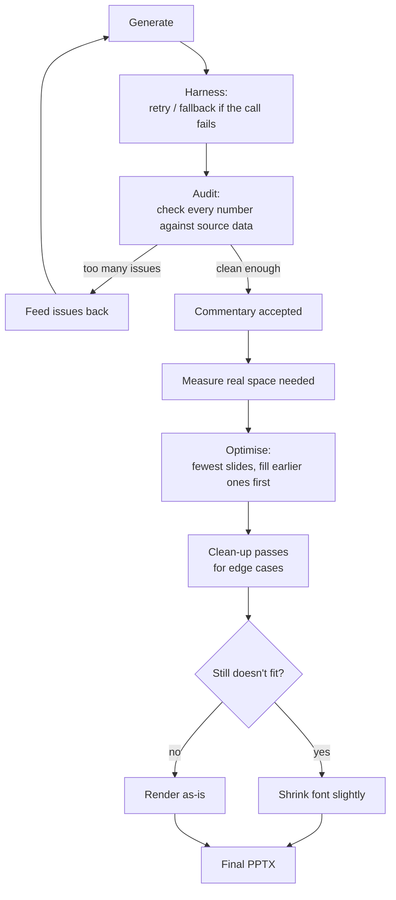

# Financial Due Diligence (FDD) Tool

Automated financial commentary generation from Excel databooks, powered by a multi-stage AI pipeline with reconciliation and PowerPoint export.

---

## Quick Start

```bash
pip install -r requirements.txt
streamlit run fdd_app.py
```

---

## Pipeline Overview

```
Excel Databook
      |
      v
+---------------------+
| 1. Profile & Resolve|  Detect sheet types, match tabs to account mappings
+---------------------+
      |
      v
+---------------------+
| 2. Normalize        |  Extract indicative-adjusted periods, build DataFrames
+---------------------+
      |
      v
+---------------------+
| 3. Reconcile        |  Cross-verify tab totals against Financials sheet (BS/IS)
+---------------------+
      |
      v
+---------------------------+
| 4. AI Subagent Pipeline   |
|                           |
|  Generator ──> Auditor ──> Validator   (Refiner: wired up, dormant)
|  (create)     (verify)    (evidence check)
|      ^                          |
|      |____ feedback loop (if needed) ____|
+---------------------------+
      |
      v
+---------------------+
| 5. PPTX Export      |  Slot-based text distribution across template slides
+---------------------+
      |
      v
  Final Report (.pptx)
```

---

## Architecture

| Module | Responsibility |
|--------|---------------|
| `fdd_utils/workbook.py` | Workbook profiling, sheet resolution, normalization, reconciliation |
| `fdd_utils/ai.py` | AI config, prompt engine, subagent pipeline + harness + audit + feedback loop |
| `fdd_utils/pptx.py` | PPTX payload building, slide generation, executive summaries |
| `fdd_utils/ui.py` | Streamlit UI, processed view, AI panel, sidebar |
| `fdd_utils/mappings.yml` | Account definitions, aliases, Generator prompts |
| `fdd_utils/prompts.yml` | Auditor / Refiner / Validator prompts |
| `fdd_utils/config.yml` | Runtime config (AI providers, agent parameters, PPTX tuning) |

---

## The Subagents

Named `subagent_1`–`subagent_4` in code/config for historical reasons, but only
**3 stages run at runtime** — `subagent_3` (Refiner) is wired up, prompted, and
tested, but deliberately dormant (`SUBAGENT_SEQUENCE` in `ai.py` skips it). It
stays in the codebase because tightening-for-length is a real, recurring need
that's cheap to re-enable (one line) the moment a account type needs it again —
removing it outright would mean re-deriving the prompt from scratch later.

| Stage | Agent | Role | Runs by default? |
|-------|-------|------|---|
| 1 | **Generator** | Creates financial commentary from data + prompts | Yes |
| 2 | **Auditor** | Verifies figures, trend direction, and format accuracy | Yes |
| 3 | **Refiner** | Tightens length while preserving key facts and reasoning | No (dormant) |
| 4 | **Validator** | Final evidence check with clause-level hallucination detection | Yes |

A feedback loop retries Generator + Auditor + Validator when too many clauses
come back unsupported — see [From AI Draft to Final Slide](#from-ai-draft-to-final-slide) below.

---

## From AI Draft to Final Slide

Four methodology-level concerns, stacked on top of each other, that turn
"call an LLM once" into a reliable pipeline:

- **Prompt** — every account type gets tailored instructions (what to cover,
  tone, length), so the model lands close to final quality in one pass
  instead of relying on trial and error.
- **Harness** — LLM calls can fail, hang, or come back garbled. The system
  retries automatically, and if a stage keeps failing, falls back to a safe
  data-only summary so the report still finishes.
- **Audit** — after the model writes commentary, every number it cites is
  checked against the actual source data by code, not by asking the model to
  grade itself. A mismatch is treated as fact — it overrides whatever the
  model claims.
- **Loop** — when too much of a bullet fails the audit, the system
  automatically regenerates it with the specific problems fed back, up to a
  couple of retries, before accepting the result.

Once commentary is accepted, it still needs to physically fit the template —
that's the packing job: decide which account's text goes in which box so
every box reads full without spilling over, using as few slides as possible.

1. **Measure real space** — how much room each account's text actually needs,
   using real font rendering, not a word-count guess.
2. **Optimise the layout** — an algorithm decides which accounts go on which
   slide, favouring filling earlier slides fully and letting only the very
   last one run lighter.
3. **Clean up edge cases** — a handful of follow-up passes catch patterns the
   main algorithm doesn't fully solve on its own, e.g. one box ending up empty
   next to a full one. This is the most iterated-on part of the system: each
   pass exists because a real generated report hit that exact pattern.
4. **A safety net, not the plan** — if content still doesn't quite fit,
   PowerPoint's own autofit shrinks the font slightly rather than cutting
   text off.

The main lever for controlling how full a page looks is upstream of all this:
each account's AI prompt carries its own word-count target, sized to that
account's real complexity — if a page looks under-filled, that's usually the
first place to look.



---

## Run

`streamlit run fdd_app.py`
