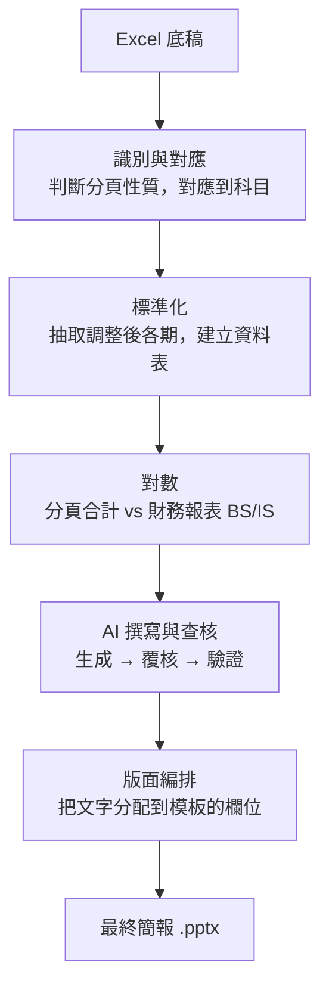
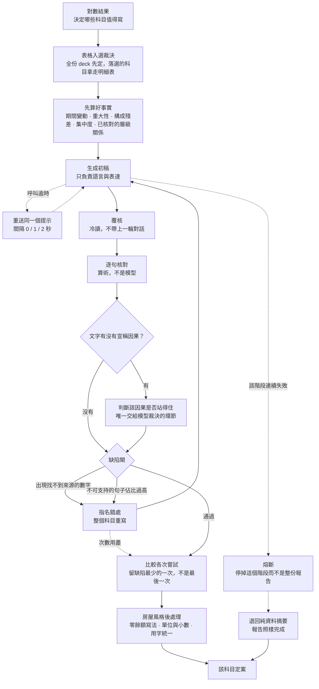
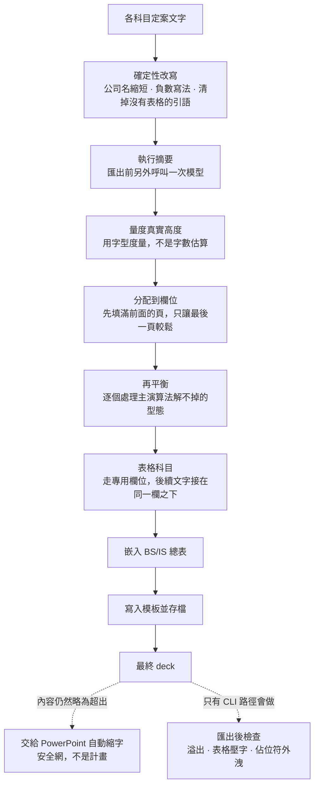

# Financial Due Diligence (FDD) Tool

Automated financial commentary generation from Excel databooks, powered by a
multi-stage AI pipeline with reconciliation and PowerPoint export.

---

## Quick Start

```bash
pip install -r requirements.txt
streamlit run fdd_app.py
```

---

## Pipeline Overview


```mermaid
flowchart TD
    A[Excel 底稿] --> B[識別與對應<br/>判斷分頁性質，對應到科目]
    B --> C[標準化<br/>抽取調整後各期，建立資料表]
    C --> D[對數<br/>分頁合計 vs 財務報表 BS/IS]
    D --> E[AI 撰寫與查核<br/>生成 → 覆核 → 驗證]
    E --> F[版面編排<br/>把文字分配到模板的欄位]
    F --> G[最終簡報 .pptx]
```

---

## Architecture

The four big modules are **packages**, not single files. Each `__init__.py`
re-exports exactly what the flat module exposed, so `from fdd_utils.pptx import X`
is unchanged.

| Module | Responsibility |
|--------|---------------|
| `fdd_utils/workbook/` | Workbook profiling, sheet resolution, normalization, reconciliation, movement analysis |
| `fdd_utils/ai/` | AI config, prompt engine, subagent pipeline, harness, deterministic verification, feedback loop |
| `fdd_utils/pptx/` | PPTX payload building, packing, slide generation, executive summaries |
| `fdd_utils/ui/` | Streamlit UI, processed view, AI panel, sidebar, headless export helpers |
| `fdd_utils/mappings.yml` | Account definitions, aliases, Generator prompts |
| `fdd_utils/prompts.yml` | Auditor / Refiner / Validator prompts, plus the shared style pack |
| `fdd_utils/config.yml` | Runtime config (AI providers, agent parameters, PPTX tuning). Per-machine, not tracked |

Diagnostic entry points live at the repo root: `inspect_databook.py` (end-to-end,
optionally with `--run-ai --export-pptx`), `inspect_pptx.py` (geometry and
overflow checks on an exported deck), and `inspect_render_truth.py` (drives real
PowerPoint over COM on Windows — the only tool that reaches actual ground truth).

---

## The Subagents

Named `subagent_1`–`subagent_4` in code and config for historical reasons, but
only **three stages run** — `subagent_3` (Refiner) is wired up, prompted and
tested, yet deliberately dormant (`SUBAGENT_SEQUENCE` in
`fdd_utils/ai/pipeline.py` skips it). It stays because tightening-for-length is a
real recurring need that costs one line to re-enable; removing it would mean
re-deriving the prompt later.

| Stage | Agent | Role | Runs by default? |
|-------|-------|------|---|
| 1 | **Generator** | Writes commentary from the data and the account's prompt | Yes |
| 2 | **Auditor** | Re-reads the draft cold against the source data | Yes |
| 3 | **Refiner** | Tightens length while preserving facts and reasoning | No (dormant) |
| 4 | **Validator** | Judges causal claims; emits clause-level verdicts | Only when the text asserts a cause |

A typical account therefore costs two LLM calls, not four.

---

## Methodology

Five ideas do most of the work. They are ordered by how much they change the
output, not by where they sit in the pipeline.

### 1. Facts are compiled before prose

The model is kept out of arithmetic wherever the answer can be settled in code.
Movements, percentage changes, materiality flags, concentration shares and
verified parent/child hierarchies are computed first and handed over as settled
facts, with an explicit instruction to quote them rather than derive anything
further. A self-derived number has no source to match against, which is exactly
where invented figures come from. One arithmetic task is still asked of the
model: reconciling an itemised composition against its total, where the residual
is precomputed only once an account carries more than three top-level
components.

Two guards worth knowing: a percentage across a sign change is meaningless, so
those movements are described qualitatively; and a stub period is annualized to
a common basis before any cross-year comparison, and excluded outright from the
revenue benchmark an expense account is measured against.

### 2. The judge is arithmetic, not a model

After the model writes, every amount it cites is checked against the account's
own source data by code. The verdict outranks the model's in both directions: it
overrides a fabricated figure the model defended, and it dismisses a
"hallucination" the model flagged on a figure that does match. A model-judged
loop can be talked round by a confident rewrite; a sum cannot.

### 3. Attempts are bounded, and the best one wins

Tell a model its answer is wrong and it will agree and change it, whether or not
it was wrong. Each extra round drifts further toward whatever the feedback
implies and further from the data. So retries are capped, and the trigger is
deliberately narrow: a provable fabrication fires one, while an unprovable
inference on its own does not — that inference is the analysis the deliverable
exists for, and the deck renders it in orange on purpose. A second, looser
trigger survives for output that is broadly unsupported rather than specifically
wrong. An arbiter then keeps the attempt with the fewest defects rather than the
last one produced.

### 4. Nothing crosses a run boundary

There is no cache file, no learned preference, no memory of a previous
engagement. Every derived fact lives for the duration of one run and is rebuilt
next time. This is a decision rather than an omission: cross-run learning is
where one reviewer's wording preference silently becomes the next client's wrong
deck. Promoting a correction stays a human edit to the prompt files.

### 5. Every rule that matters lives in code, not only in a prompt

A rule that exists only as prompt text is a preference, not a guarantee. Where a
convention is load-bearing — zero balances reading as "no balance" rather than
"0", magnitude units and decimal places, company names shortened after first
mention — it is enforced deterministically after the model is finished. Two
attempts to hold the company-name rule through prompting alone did not survive
real runs.

### 單一科目:撰寫、查核、定案

Solid arrows are the normal path; dotted arrows are what happens when something
goes wrong. Note where the layout decision sits — the deck-wide ruling on which
accounts get a detail table is made **before** any prompt is built, so the text
can only promise a table that will actually be drawn.


```mermaid
flowchart TD
    RE[對數結果<br/>決定哪些科目值得寫] --> SUB[表格入選裁決<br/>全份 deck 先定，落選的科目拿走明細表]
    SUB --> FACT[先算好事實<br/>期間變動 · 重大性 · 構成殘差 · 集中度 · 已核對的層級關係]
    FACT --> GEN[生成初稿<br/>只負責語言與表達]

    GEN -.->|呼叫逾時| RETRY[重送同一個提示<br/>間隔 0 / 1 / 2 秒]
    RETRY -.-> GEN
    GEN -.->|該階段連續失敗| BRK[熔斷<br/>停掉這個階段而不是整份報告]
    BRK -.-> FB[退回純資料摘要<br/>報告照樣完成]

    GEN --> AUD[覆核<br/>冷讀，不帶上一輪對話]
    AUD --> CHK[逐句核對<br/>算術，不是模型]
    CHK --> Q{文字有沒有宣稱因果？}
    Q -- 有 --> VAL[判斷該因果是否站得住<br/>唯一交給模型裁決的環節]
    Q -- 沒有 --> GATE
    VAL --> GATE{缺陷閘}

    GATE -->|出現找不到來源的數字| FEED[指名錯處<br/>整個科目重寫]
    GATE -->|不可支持的句子佔比過高| FEED
    FEED --> GEN
    FEED -.->|次數用盡| ARB
    GATE -->|通過| ARB[比較各次嘗試<br/>留缺陷最少的一次，不是最後一次]

    ARB --> HS[房屋風格後處理<br/>零餘額寫法 · 單位與小數 · 用字統一]
    HS --> OUT[該科目定案]
    FB --> OUT
```

### 版面編排與匯出


```mermaid
flowchart TD
    A[各科目定案文字] --> B[確定性改寫<br/>公司名縮短 · 負數寫法 · 清掉沒有表格的引語]
    B --> C[執行摘要<br/>匯出前另外呼叫一次模型]
    C --> D[量度真實高度<br/>用字型度量，不是字數估算]
    D --> E[分配到欄位<br/>先填滿前面的頁，只讓最後一頁較鬆]
    E --> F[再平衡<br/>逐個處理主演算法解不掉的型態]
    F --> G[表格科目<br/>走專用欄位，後續文字接在同一欄之下]
    G --> H[嵌入 BS/IS 總表]
    H --> I[寫入模板並存檔]
    I --> J[最終 deck]
    J -.->|內容仍然略為超出| K[交給 PowerPoint 自動縮字<br/>安全網，不是計畫]
    J -.->|只有 CLI 路徑會做| L[匯出後檢查<br/>溢出 · 表格壓字 · 佔位符外洩]
```

---

## Known limits

Stated because a tool that hides its blind spots is harder to trust than one
that names them.

- **The grounding pool is broad, and that cuts both ways.** It holds each
  numeric cell, column totals, sums of runs of two to four adjacent rows,
  figures quoted in the notes, the historical comparison columns, and — for
  accounts of the same statement type — the same again from every sibling tab.
  So a figure derived another way (a difference, a sum of non-adjacent rows, a
  cross-statement reference) is not in it and will be flagged; and a pool that
  wide can also ground a figure by coincidence, on a tab the sentence is not
  even about. Bare numbers and percentages are deliberately not treated as
  groundable amounts at all, so a wrong ratio is never caught here.
- **A `data-backed` verdict is weak evidence, not proof.** Matching carries a
  tolerance, so the verdict is weakest exactly where the amounts are small. It
  is also not a single meaning: a clause whose only defect is an unverifiable
  causal claim is demoted back to `data-backed` by a confidence floor rather
  than shown as flagged, so the label covers both "the numbers matched" and
  "nothing here was checkable".
- **Unsupported clauses are rare, and most are judgement rather than
  arithmetic.** Across the archived runs, roughly one clause in sixty comes back
  unsupported. About a quarter of those are the arithmetic kind — a figure the
  grounding pool cannot find. The remaining three quarters are the model's own
  opinion that something is unsupported, which no amount of recomputation
  settles. Note the rate is measured *after* the confidence demotion above, so
  it understates how much went unchecked.
- **Extraction depth is the real ceiling on analysis.** When a workpaper's
  breakdown does not survive extraction, no amount of verification or prompting
  recovers it. This is a per-firm structural problem rather than an industry one.
- **Layout can only be confirmed in real PowerPoint.** Every check in this repo
  except `inspect_render_truth.py` compares the model against itself, so a clean
  `inspect_pptx.py` run is not evidence that PowerPoint agrees.
- **False-positive and false-negative rates for the verification layer have not
  been measured** — only how often each verdict occurs.

See [`methods.md`](methods.md) for the verification loop in detail, including why
the retry gate is shaped the way it is and what the arbiter is guarding against.

---

## Run

```bash
streamlit run fdd_app.py                                    # the app
python inspect_databook.py <databook.xlsx>                  # free diagnostics
python inspect_databook.py <databook.xlsx> --run-ai --export-pptx   # full run
python inspect_pptx.py <deck.pptx>                          # geometry checks
```
